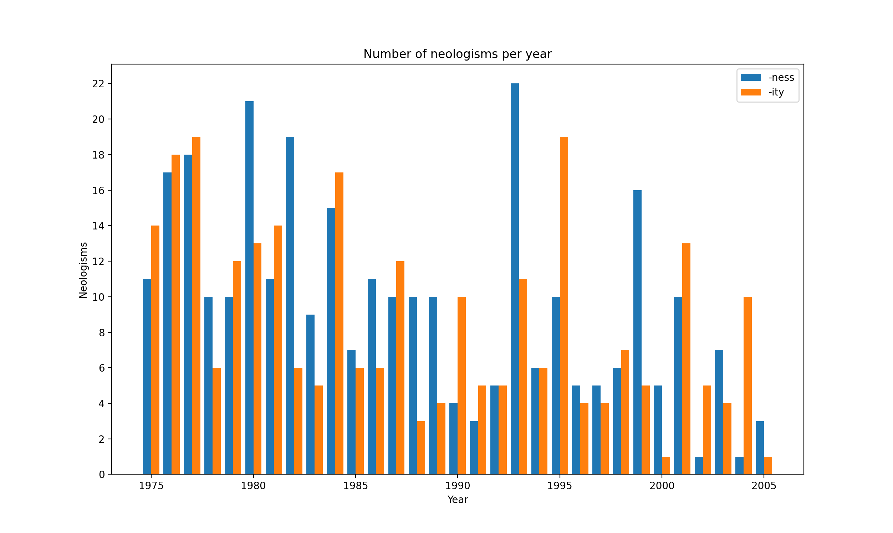

# 24914-affix-productivity

Code for my Assignment 2 for 24.914 as taken in Spring 2021.

The paper responds to [Baayen and Renouf (1996)](https://www.jstor.org/stable/416794), in which the authors analyze the productivity of English affixes in issues of the London newspaper the Times from 1989-1992. They discover that between the competitor affixes *-ness* and *-ity*, *-ness* is more productive, and that the discrepancy in productivity actually widened over time. Using the # of recorded neologisms as an indicator of productivity, they find that *-ness* overall coins more neologisms than *-ity*, and that by the end of the sample period *-ness* had become more productive.

This result struck me as unintuitive, especially given the short timespan, so I sought to investigate the same phenomenon with a different corpus: namely, the [Corpus of Historical American English (COHA)](https://doi.org/10.7910/DVN/8SRSYK). Could these trends be replicated, and would they also be seen on a larger timescale?

## Results
My analysis is slightly different than Baayen and Renouf's in that I analyze by year, and not by chunks of tokens. Each year in COHA has a different total number of words and isn't dated finer than the year timescale, so this analysis was not possible. As a result, I instead normalize by dividing the count for each year by the total number of words in that year. I plot my results below.

My analysis does not replicate Baayen and Renouf's result. While I also find that *-ness* is more productive than *-ity*, the discrepancy is not as large as that found by Baayen and Renouf. Furthermore, we do not observe the increasing productivity of *-ness* in the time period from 1989-1992.

## Usage
First, download the COHA corpus on the desired decade ranges, specifically the zipped word-lemma-part of speech (wlp) files. Put the unzipped folders into a folder `data/COHA_zips`.

Next, edit the variables at the top of `calculate_neologisms.py` to your desired suffixes and year ranges. (Untested beyond the default; current regex is specifically for suffixes.)

Run `python3 calculate_neologisms.py` to locate and count the neologisms; they will appear as .json files in the root folder and in `data/recorded_neologisms`. One can then manually inspect the results or run `python3 plot_data` to plot them, although the current plotting setup is hardcoded for *-ness*/*-ity*.
